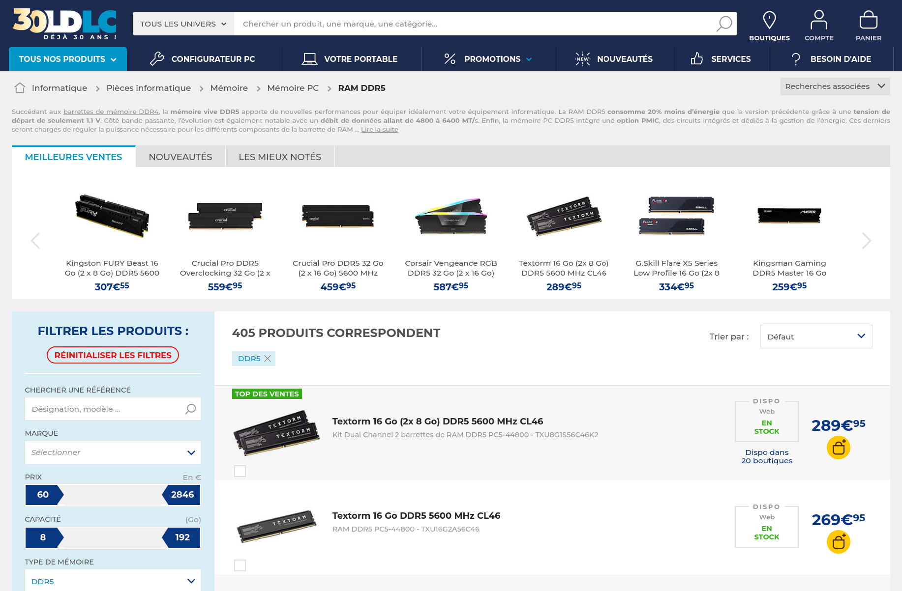
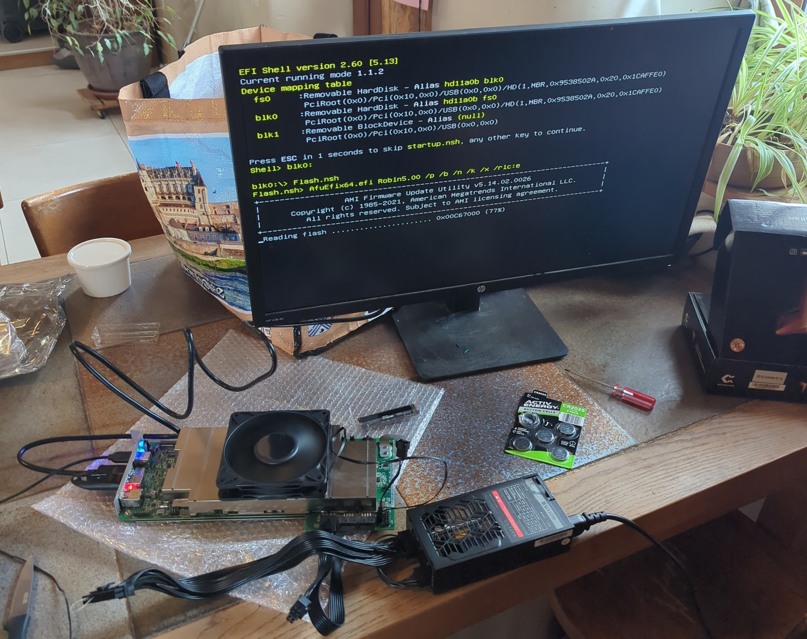
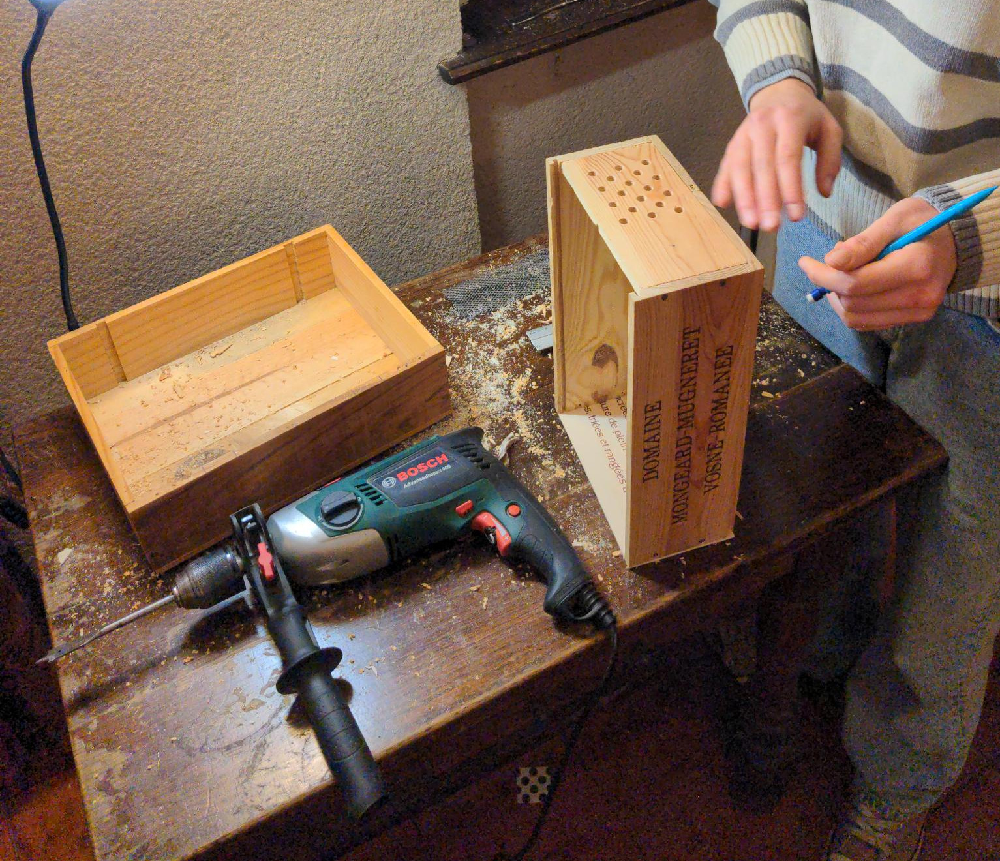
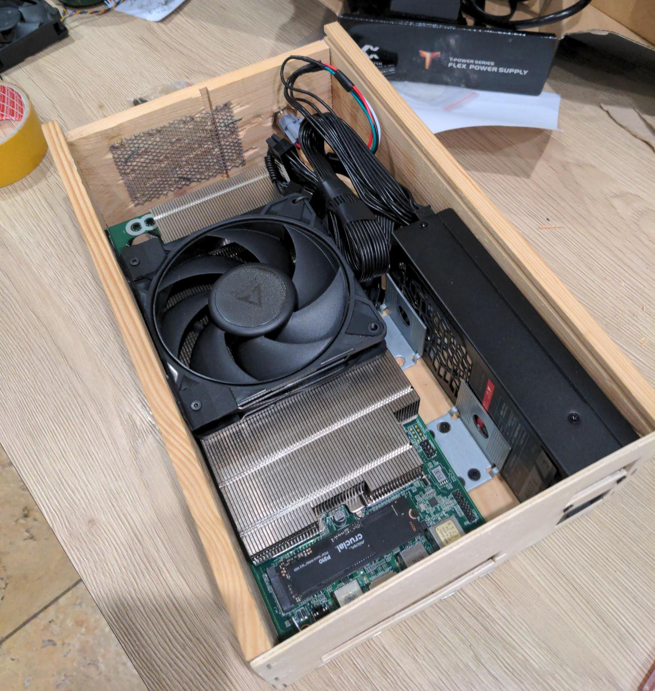
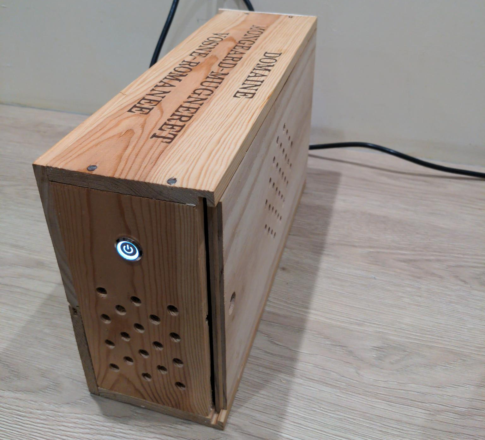

At the end of year 2025, the AI hype was thought to be vanishing by some, but
the world was shocked when
[Micron announced](https://investors.micron.com/news-releases/news-release-details/micron-announces-exit-crucial-consumer-business)
they would abandon the consumer market (PC builders, PC gamers) in favor of AI
data centers. The RAM prices skyrocketed to absurd levels.

<i> RAM Prices Feb 1st, 2026</i>

GPUs already had already gotten pretty expensive, but now these new RAM
shortages were making PC gaming a luxury. At this time, one of my family members
got into PC gaming, and asked me tech advice on buying a small form factor PC
for casual gaming, but that could still play demanding titles. Achieving this at
a low cost was really challenging in the current time.

Luckily, a few days earlier, I watched a
[YouTube video by ETA Prime](https://www.youtube.com/watch?v=StqSCfX9luQ)
showcasing the ASRock AMD BC-250, a powerful ex-mining board featuring a
cut-down PlayStation 5 APU. Originally designed for cryptocurrency mining, the
community transformed this hardware into a capable Linux gaming and desktop
system, thanks to extensive community reverse-engineering and Linux driver
development.

After re-watching the video a few times, and getting more detailed information
on the amazing [AMD BC250 wiki](https://elektricm.github.io/amd-bc250-docs)
website, I proposed to the family member that I could try to build a cheap
custom made PC starting from this board. Perfect for the casual gaming
experience I had in mind.

Some research later, I ordered the parts:

| Part                                                        | Cost        |
| ----------------------------------------------------------- | ----------- |
| AMD BC-250 board                                            | 173.39€     |
| Crucial SSD 512GB                                           | 79.99€      |
| METALFISH Flex 500W 80PLUS PSU                              | 64.61€      |
| Threaded inserts + M3 screws + LED self-locking push button | 10.12€      |
| **Total**                                                   | **328.12€** |

The hardest part on that build was the case, funny for one of the least
functional components. I originally planned it to be 3D printed using my old
_Alfawise U20_ with PCTG black filament. However after multiple failed prints I
gave up.

Meanwhile the parts arrived, we assembled them, and after some soldering for
fixing the Flex ATX power supply not supplying current
([2 wires need to be shorted](https://www.overclockersclub.com/guides/atx_psu_startup/)
to signify that the system requires power), the system booted!

<i> First boot </i>

We followed the wiki instructions to flash a custom BIOS (_enables dynamic VRAM
allocation and grants access to advanced chipset settings_) which was quickly
done. I settled on [Bazzite](https://bazzite.gg/) for the OS (GNU+Linux
distribution really), because I experienced it as a stable and well thought
distro, which offers a SteamOS/console like experience, through Gamescope +
Steam Big Picture mode.   Windows wasn't an option, because it coudldn't
support the GPU drivers of the board (and even, why would you want to use
Windows in 2026 ?).

After moving to my _"client's"_ place in _Bourgogne-Franche-Comté_, we needed to
build a proper box. We planned on using a _Vosne-Romanée 1er Cru_ wine box,
which we'd process using a jigsaw and a drill, and creating screw holes using
threaded inserts.

<i> Woodworking </i>

In the end we got a result we were very proud of! Everything fit together
perfectly, keeping a small form factor.

<i> The guts of the beast </i>

The whole build process took a day, and was very enjoyable! The built machine
looked amazing, as well as the games it could run, with no lag while remaining
reasonable thermal wise (< 80°C).

I didn't have time to test a lot of games besides Zelda BOTW emulation through
Yuzu Emulator, which ran at a consistent 30FPS (the game is locked as this
framerate), outperforming a native Nintendo Switch on load times.

My _"client"_ was very pleased with the final result, and very grateful to our
work. In the future, he/she might put me in touch with other people looking for
a cheap, personalized gaming rig.

<i> Finished build </i>

