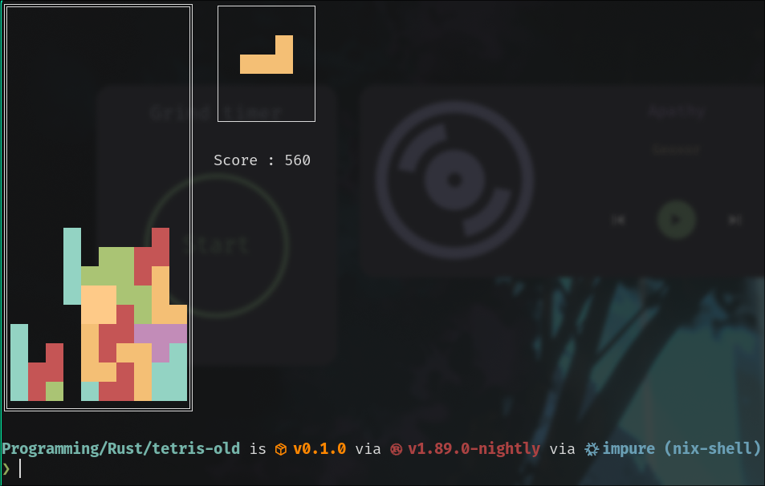
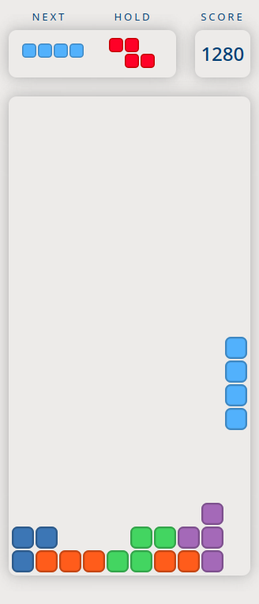
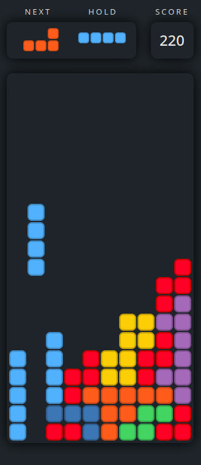

My first project to learn the Rust 🦀 programming language! (April 2024)

I initially started this journey with the [crossterm](https://crates.io/crates/crossterm) crate to render my game in the terminal. 
It took me a few days to undertand the various hoops and subtilities of the Rust programming language, but in the end it showed me how well-made the language is! When doing Rust you can feel how much thought went in defining the language's semantics and way of handling memory management. Truly a good programming experience!

For the first version, I ended up with this:

The game worked well! but I wanted to level-up the UI aesthetics using a proper UI library. For this I used the [Slint](https://slint.dev/) project as a dependency of my game. It lets you describe the UI part in separate files in a language akin to HTML/CSS, allowing clear separation between the presentation layer and internal game logic.

It also lets you export your project on many platforms, Desktop, Mobile, Web (online version playable [here](https://www.gasdev.fr/slint-tetris/) 😉) and even embedded platforms such as an **ESP32** or a **Raspberry Pi Pico**.

Thanks to some inspiration I could get over at [Dribbble](https://dribbble.com/shots/9976347-Neumorphic-Tetris), and the powerful Slint API, I was able to make a pretty good looking game design:

*Light version*

*Dark version*

Also quick note, my game also made its way in the [Slint's website showcase](https://slint.dev/showcase#tetris) 😁!

For the future, some furter efforts could be made to add button controls to make the game playable on mobile phones. Anyways that's all cheers, thanks for reading!