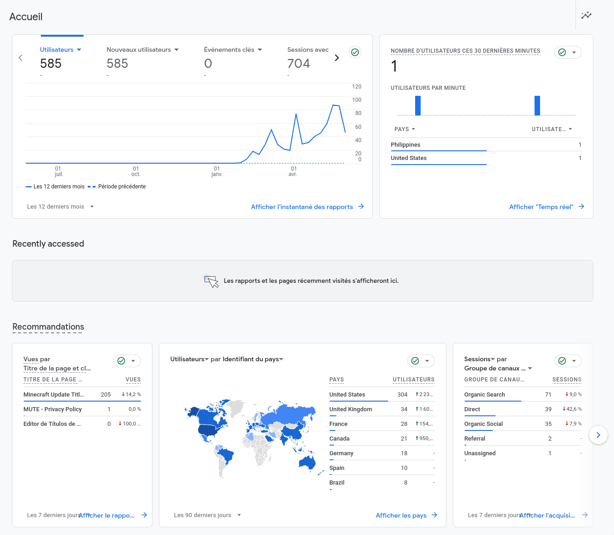

This is my first attempt at making a _kinda_ successful website, I don't remember where I got this idea from, but one day (January the 29th of 2024 to be precise), I created a task in my calendar spanning over 1 week saying "Minecraft update logo creator".

The idea was simple, make a simple website that allow the users to create _Minecraft style update logos_ such as this one,  with arbitrary text content, fonts and textures in an easy to use interface.

I week would have been quite a challenge if [Ewan Howell](https://github.com/ewanhowell5195) did not maintain the [Minecraft Title Generator](https://github.com/ewanhowell5195/MinecraftTitleGenerator) repo, which is a [BlockBench](https://www.blockbench.net/) plugin that is used for the same reasons as my final website, but better. That basically allowed me not to care about making the 3D fonts for the website, thanks dude!

I'm not going to bother you about the implementations details (it's open-source anyways), but just mention that used the [AstroJS](https://astro.build) framework, and that I ended up making my own **TypeScript** state manager to share value/store change events between the app components, instead of using something like [nanostores](https://github.com/nanostores/nanostores).

After 4 days, I had a fully working prototype, that I deployed on the internet using Vercel on February the 2nd of 2024, initially with the domain [minecraft-update-title-editor.vercel.app](https://minecraft-update-title-editor.vercel.app). However, I later decided to change the domain name to [titlemc.app](https://titlemc.app) to make it more memorable and easier to type. In the following days, I updated the Website to be responsive, fixed some bugs, and improved the load times and SEO scores using [Google's LightHouse](https://github.com/GoogleChrome/lighthouse).

I also experimented with **Google Analytics** in order to have some insights on my website's users. In case you've never seen an Analytics dashboard, here's how it looks:

Pretty terrifying! I can see where my users connected, when, how much time they've spent on my site, from which source (social media link, google search, ...) they're from, that's not everything, but it's still a lot of infos.

Seeing all of these countries trying to access my website made me want to add translations to my website, fortunately **AstroJS** simplifies this process, especially when using community integrations like [astro-i18n-aut](https://github.com/jlarmstrongiv/astro-i18n-aut) which allowed me to automatically create new page routes for each new language. I simply defined my english translations in a [JSON datastructure](https://github.com/GaspardCulis/MUTE/blob/main/src/i18n/ui.ts#L11) and asked LLMs (Mistral Large) to add new ones based on the existing stucture. I hope this addition will bring more new users to my site!

I also tried to make some cash by adding Asdense ads to my website, however they still refuse to approve my website for some unknown reason, even if I added the boring cookie banners and Privacy Policy...

Anyway this project proved me that a lot could be made in 1 to 2 weeks, and I hope that some day this website will pay-out!
